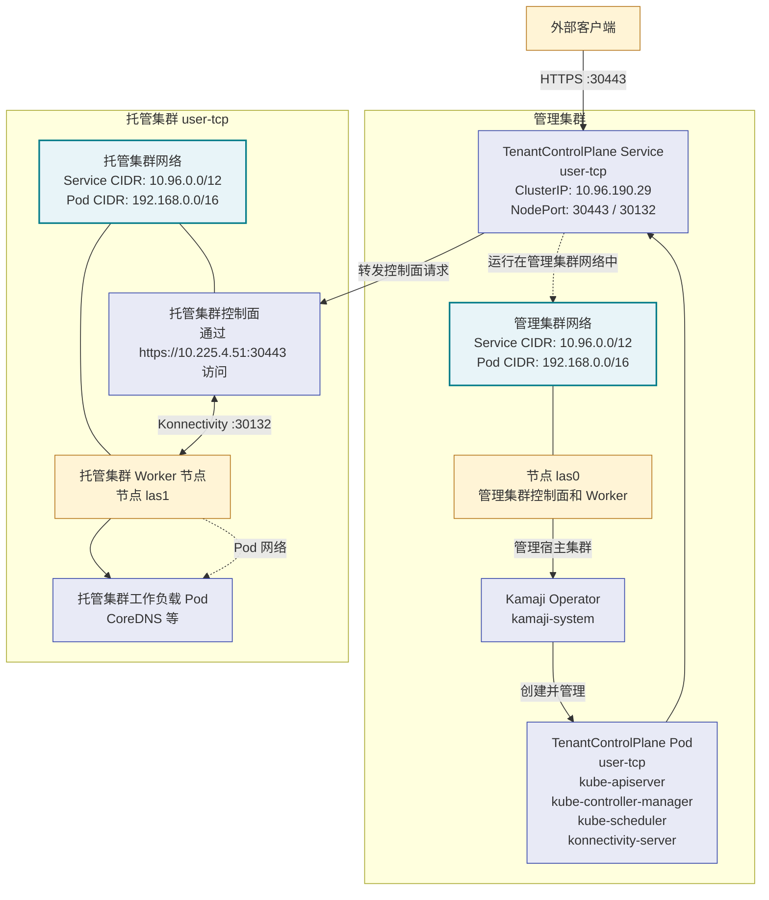

# Kamaji

<https://kamaji.clastix.io/>

## 准备工作

- 须先安装 <project:cert_manager.md>.
- 一个默认的 StorageClass, 对应的 CSI driver 必须开通，可以用 <project:local_path_provisioner.md>.

## 用 helm 安装

下载 helm 安装包：

```console
$ helm repo add clastix https://clastix.github.io/charts
"clastix" has been added to your repositories
$ helm repo update
$ helm pull clastix/kamaji --version=0.0.0+latest
```

库里面有版本号的包其实非常旧，非订阅用户只能下载最新版，不支持指定版本号。

安装：

```console
$ helm install kamaji kamaji-0.0.0+latest.tgz --namespace kamaji-system --create-namespace --set datastore.enabled=true
NAME: kamaji
LAST DEPLOYED: Tue Aug 25 11:30:32 2026
NAMESPACE: kamaji-system
STATUS: deployed
REVISION: 1
TEST SUITE: None
NOTES:
List the available CRDs installed by Kamaji:
  kubectl get customresourcedefinitions.apiextensions.k8s.io

List all the Tenant Control Plane resources deployed in your cluster:
  kubectl get tenantcontrolplanes.kamaji.clastix.io --all-namespaces
```

安装后的工作负载：

```console
$ kubectl get all -n kamaji-system
NAME                          READY   STATUS    RESTARTS   AGE
pod/kamaji-6d59c9bd6d-cqgt9   1/1     Running   0          4m29s
pod/kamaji-etcd-0             1/1     Running   0          4m29s
pod/kamaji-etcd-1             1/1     Running   0          4m19s
pod/kamaji-etcd-2             1/1     Running   0          4m7s

NAME                             TYPE        CLUSTER-IP       EXTERNAL-IP   PORT(S)             AGE
service/kamaji-etcd              ClusterIP   None             <none>        2379/TCP,2380/TCP   4m29s
service/kamaji-etcd-client       ClusterIP   10.108.182.121   <none>        2379/TCP,2381/TCP   4m29s
service/kamaji-metrics-service   ClusterIP   10.98.207.182    <none>        8080/TCP            4m29s
service/kamaji-webhook-service   ClusterIP   10.100.67.74     <none>        443/TCP             4m29s

NAME                     READY   UP-TO-DATE   AVAILABLE   AGE
deployment.apps/kamaji   1/1     1            1           4m29s

NAME                                DESIRED   CURRENT   READY   AGE
replicaset.apps/kamaji-6d59c9bd6d   1         1         1       4m29s

NAME                           READY   AGE
statefulset.apps/kamaji-etcd   3/3     4m29s
```

安装的 CRDs:

```console
$ kubectl api-resources --api-group kamaji.clastix.io
NAME                   SHORTNAMES   APIVERSION                   NAMESPACED   KIND
datastores                          kamaji.clastix.io/v1alpha1   false        DataStore
kubeconfiggenerators   kc           kamaji.clastix.io/v1alpha1   false        KubeconfigGenerator
tenantcontrolplanes    tcp          kamaji.clastix.io/v1alpha1   true         TenantControlPlane
```

可以看到每个 etcd Pod 绑定的 pvc 用了默认存储类：

```console
$ kubectl get pvc -n kamaji-system
NAME                 STATUS   VOLUME                                     CAPACITY   ACCESS MODES   STORAGECLASS   VOLUMEATTRIBUTESCLASS   AGE
data-kamaji-etcd-0   Bound    pvc-3db63b2c-22b2-4980-be8a-8973ab684843   8Gi        RWO            local-path     <unset>                 22h
data-kamaji-etcd-1   Bound    pvc-eeb351ec-350e-4b5f-a212-5a21c43ccd69   8Gi        RWO            local-path     <unset>                 22h
data-kamaji-etcd-2   Bound    pvc-8510ba02-efb1-4c94-bc16-6038bf028722   8Gi        RWO            local-path     <unset>                 22h
```

因为指定了 `--set datastore.enabled=true`, 因此生成了一个 DataStore:

```console
$ kubectl get datastore -n kamaji-system
NAME      DRIVER   READY   AGE
default   etcd     true    4m25s
```

没有 DataStore 将无法创建控制平面。

## 创建一个控制平面

控制平面由 TenantControlPlane 代表（目前只支持到 Kubernetes v1.36）：

:::{literalinclude} /_files/macos/workspace/k8s/kamaji/tcp.yaml
:::

此处需要解释：

- 为了简单使用了 NodePort 类型的服务，所以每个控制面需要不同的端口，并且不能与管理集群端口冲突。如果有 LB 则可以通过不同 IP 区分
- NodePort 类型的端口号必须在 30000-32767 范围内，所以将控制平面端口设为 30443
- Kamaji 使用 Konnectivity 组件桥接控制平面和节点之间的通信，默认为 8132 端口，现改为 30132 端口
- 当使用 NodePort 方式暴露服务时，必须设置 `spec.networkProfile.address` 为管理集群的一个节点 IP, 并且必须能外部（将要加入新控制平面的 Worker 节点）访问
- 用于访问控制平面的其他 IP 和域名写入 `certSANs` 列表
- 控制平面可以部署多个副本，通过设置 `spec.controlPlane.deployment.replicas`

将以上内容保存为文件 `tcp.yaml`, 应用到集群：

```console
$ kubectl create ns tenant-ns
namespace/tenant-ns created
$ kubectl apply -f tcp.yaml
tenantcontrolplane.kamaji.clastix.io/user-tcp created
```

结果：

```console
$ kubectl get tcp -n tenant-ns
NAME       VERSION   INSTALLED VERSION   STATUS   CONTROL-PLANE ENDPOINT   KUBECONFIG                  DATASTORE   AGE
user-tcp   v1.35.8   v1.35.8             Ready    10.225.4.51:30443        user-tcp-admin-kubeconfig   default     88s
```

Kamaji 根据 TenantControlPlane 的信息创建了控制平面的工作负载：

```console
$ kubectl get all -n tenant-ns
NAME                            READY   STATUS    RESTARTS   AGE
pod/user-tcp-8668876c55-5g76d   4/4     Running   0          102s

NAME               TYPE       CLUSTER-IP     EXTERNAL-IP   PORT(S)                           AGE
service/user-tcp   NodePort   10.96.190.29   <none>        30443:30443/TCP,30132:30132/TCP   116s

NAME                       READY   UP-TO-DATE   AVAILABLE   AGE
deployment.apps/user-tcp   1/1     1            1           103s

NAME                                  DESIRED   CURRENT   READY   AGE
replicaset.apps/user-tcp-756bd49fcf   0         0         0       103s
replicaset.apps/user-tcp-7f54dc5cbc   0         0         0       102s
replicaset.apps/user-tcp-8668876c55   1         1         1       102s
replicaset.apps/user-tcp-cbf646f97    0         0         0       103s
```

注意服务 `user-tcp` 是新控制平面的入口，它的 Cluster IP 仍然是管理集群的 IP, 控制平面端口和 Konnectivity 端口必须开放。

Deployment 的详细信息：

```console
$ kubectl get deploy user-tcp  -n tenant-ns -owide
NAME       READY   UP-TO-DATE   AVAILABLE   AGE     CONTAINERS                                                                  IMAGES                                                                                                                                                                                                                                                         SELECTOR
user-tcp   1/1     1            1           2m28s   kube-apiserver,kube-scheduler,kube-controller-manager,konnectivity-server   registry.aliyuncs.com/google_containers/kube-apiserver:v1.35.8,registry.aliyuncs.com/google_containers/kube-scheduler:v1.35.8,registry.aliyuncs.com/google_containers/kube-controller-manager:v1.35.8,registry.k8s.io/kas-network-proxy/proxy-server:v0.35.0   kamaji.clastix.io/name=user-tcp
```

可见每一个 Pod 都包含了控制平面需要的所有组件和 konnectivity-server.

## 访问新集群

虽然是 NodePort 类型的服务，但由于证书的限制，只能用指定的 URL 访问：

```console
$ curl -k https://10.225.4.51:30443/healthz
ok
$ curl -k https://10.225.4.51:30443/version
{
  "major": "1",
  "minor": "35",
  "emulationMajor": "1",
  "emulationMinor": "35",
  "minCompatibilityMajor": "1",
  "minCompatibilityMinor": "34",
  "gitVersion": "v1.35.8",
  "gitCommit": "1c2e10a409eb1b03f2f28f401ce935312e20d9fb",
  "gitTreeState": "clean",
  "buildDate": "2026-08-20T15:16:16Z",
  "goVersion": "go1.26.5",
  "compiler": "gc",
  "platform": "linux/amd64"
}
```

获得 admin kubeconfig:

```console
$ kubectl get secret user-tcp-admin-kubeconfig -n tenant-ns -ojsonpath='{.data.admin\.conf}' | base64 -d
apiVersion: v1
clusters:
- cluster:
    certificate-authority-data: ...
    server: https://10.225.4.51:30443
  name: user-tcp
contexts:
- context:
    cluster: user-tcp
    user: kubernetes-admin
  name: kubernetes-admin@user-tcp
current-context: kubernetes-admin@user-tcp
kind: Config
users:
- name: kubernetes-admin
  user:
    client-certificate-data: ...
    client-key-data: ...
```

将以上 kubeconfig 保存成文件 `user.kubeconfig`, 然后可以用它来访问集群了：

```console
$ kubectl cluster-info --kubeconfig=user.kubeconfig
Kubernetes control plane is running at https://10.225.4.51:30443
CoreDNS is running at https://las0:30443/api/v1/namespaces/kube-system/services/kube-dns:dns/proxy

To further debug and diagnose cluster problems, use 'kubectl cluster-info dump'.
$ kubectl get ns --kubeconfig=user.kubeconfig
NAME              STATUS   AGE
default           Active   6m48s
kube-node-lease   Active   6m48s
kube-public       Active   6m48s
kube-system       Active   6m48s
$ kubectl get svc --kubeconfig=user.kubeconfig
NAME         TYPE        CLUSTER-IP   EXTERNAL-IP   PORT(S)   AGE
kubernetes   ClusterIP   10.96.0.1    <none>        443/TCP   6m58s
$ kubectl get no --kubeconfig=user.kubeconfig
No resources found
```

最后的信息表明集群内还没有 Worker 节点，同时会发现一些系统的服务运行不起来：

```console
$ kubectl get all --kubeconfig=user.kubeconfig -n kube-system 
NAME                          READY   STATUS    RESTARTS   AGE
pod/coredns-9444bc947-mf9wg   0/1     Pending   0          7m33s
pod/coredns-9444bc947-pgccb   0/1     Pending   0          7m33s

NAME               TYPE        CLUSTER-IP    EXTERNAL-IP   PORT(S)                  AGE
service/kube-dns   ClusterIP   10.128.0.10   <none>        53/UDP,53/TCP,9153/TCP   7m41s

NAME                                DESIRED   CURRENT   READY   UP-TO-DATE   AVAILABLE   NODE SELECTOR            AGE
daemonset.apps/konnectivity-agent   0         0         0       0            0           kubernetes.io/os=linux   7m43s
daemonset.apps/kube-proxy           0         0         0       0            0           kubernetes.io/os=linux   7m42s

NAME                      READY   UP-TO-DATE   AVAILABLE   AGE
deployment.apps/coredns   0/2     2            0           7m42s

NAME                                DESIRED   CURRENT   READY   AGE
replicaset.apps/coredns-9444bc947   2         2         0       7m33s
```

运行不起来的原因是没有 Worker 节点：

```console
$ kubectl --kubeconfig=user.kubeconfig get event -n kube-system --field-selector='reason=FailedScheduling'
LAST SEEN   TYPE      REASON             OBJECT                        MESSAGE
7m59s       Warning   FailedScheduling   pod/coredns-9444bc947-mf9wg   no nodes available to schedule pods
7m55s       Warning   FailedScheduling   pod/coredns-9444bc947-mf9wg   no nodes available to schedule pods
8m          Warning   FailedScheduling   pod/coredns-9444bc947-pgccb   no nodes available to schedule pods
7m55s       Warning   FailedScheduling   pod/coredns-9444bc947-pgccb   no nodes available to schedule pods
```

## 添加节点

可以用已知的方式向新的控制平面添加节点。

### 使用 `kubeadm`

创建 token 并输出添加节点的命令：

```console
$ kubeadm --kubeconfig=user.kubeconfig token create --print-join-command
kubeadm join 10.225.4.51:30443 --token 3ha0pt.h24armczjti8v35y --discovery-token-ca-cert-hash sha256:3348e46f32c6742e9c7bc6c0c5d182dc042f7bf98359b8d3e5a3bfa88cd87b83
```

以 `root` 用户身份在其他节点上运行这个命令即可将节点加入。

```console
$ kubectl get no --kubeconfig=user.kubeconfig
NAME   STATUS   ROLES    AGE   VERSION
las1   Ready    <none>   17s   v1.35.8
```

Kamaji 实现了控制平面与节点分离，所以这个集群里不存在 control-plane 角色的节点。

现在有节点可以调度系统服务了，但还需要安装 CNI 以后网络才能工作。

## 安装 CNI

需要安装一种 CNI 插件，以 Calico 为例：

```console
$ kubectl --kubeconfig=user.kubeconfig create -f tigera-operator-3.32.2.yaml
```

进行下一步安装的时候须确保 Installation 对象的 cidr 设置与新集群的 Pod CIDR 一致：

```console
$ kubectl --kubeconfig=user.kubeconfig create -f custom-resources-3.32.2.yaml
```

## 网络拓扑

以上部署完成后的网络拓扑图（AI 辅助编写）：



## Konnectivity

一般集群的各个节点和控制平面之间可以直接通信，因此不需要 Konnectivity. 在 Kamaji 管理的集群中，控制平面与其 Worker 节点不一定能直接通信，因此默认启用了 Konnectivity.

参考网址：

- [Kamaji 关于 konnectivity 的介绍](https://kamaji.clastix.io/concepts/konnectivity/)
- [Kubernetes 关于 konnectivity 的文档](https://kubernetes.io/docs/tasks/extend-kubernetes/setup-konnectivity/)

Konnectivity 有两个组件，安装在控制平面上的 konnectivity-server 和安装在 Worker 节点上的 konnectivity-agent.

```console
$ kubectl --kubeconfig user.kubeconfig -n kube-system get ds konnectivity-agent       
NAME                 DESIRED   CURRENT   READY   UP-TO-DATE   AVAILABLE   NODE SELECTOR            AGE
konnectivity-agent   1         1         1       1            1           kubernetes.io/os=linux   4h
```

这是一个 DaemonSet, 因此每个新加入的节点都会启动一个 agent. 这个 agent 会向 konnectivity-server 注册。

类似以下的功能都必须经由 Konnectivity 转发实现：

- 在 Pod 中执行命令 (`kubectl exec`)
- 获取 log (`kubectl logs`)
- 端口转发 (`kubectl port-forwarding`)

## Kamaji 终端

Kamaji 终端实际上是一个 Web 管理应用，与 Kamaji 部署在同一个管理集群里。

首先创建一个 Secret:

```console
cat <<EOF | kubectl apply -f -
apiVersion: v1
kind: Secret
type: Opaque
metadata:
  name: kamaji-console
  namespace: kamaji-system
stringData:
  ADMIN_EMAIL: admin@kamaji.sys
  ADMIN_PASSWORD: abc123
  JWT_SECRET: jwt_secret
  NEXTAUTH_URL: https://10.220.70.56:8080/ui
EOF
```

这里的 `ADMIN_EMAIL` 和 `ADMIN_PASSWORD` 将用于登录终端。

用 helm 安装：

```console
$ helm pull clastix/kamaji-console
$ helm install console kamaji-console-0.1.3.tgz -n kamaji-system
NAME: console
LAST DEPLOYED: Thu Aug 27 11:16:20 2026
NAMESPACE: kamaji-system
STATUS: deployed
REVISION: 1
NOTES:
1. Get the application URL by running these commands:
  export POD_NAME=$(kubectl get pods --namespace kamaji-system -l "app.kubernetes.io/name=kamaji-console,app.kubernetes.io/instance=console" -o jsonpath="{.items[0].metadata.name}")
  export CONTAINER_PORT=$(kubectl get pod --namespace kamaji-system $POD_NAME -o jsonpath="{.spec.containers[0].ports[0].containerPort}")
  echo "Visit http://127.0.0.1:8080/ui to use your application"
  kubectl --namespace kamaji-system port-forward $POD_NAME 8080:$CONTAINER_PORT
```

通过端口转发暴露服务：

```console
$ kubectl port-forward svc/console-kamaji-console -n kamaji-system 8080:80
Forwarding from 127.0.0.1:8080 -> 3000
Forwarding from [::1]:8080 -> 3000
```

访问 `https://localhost:8080/ui` 可以看到登录界面。登录后界面：


可见除 "Tenant Control Planes" 和 "Datastores" 两项外，其他功能都标记为 "Pro" 或不可用。
